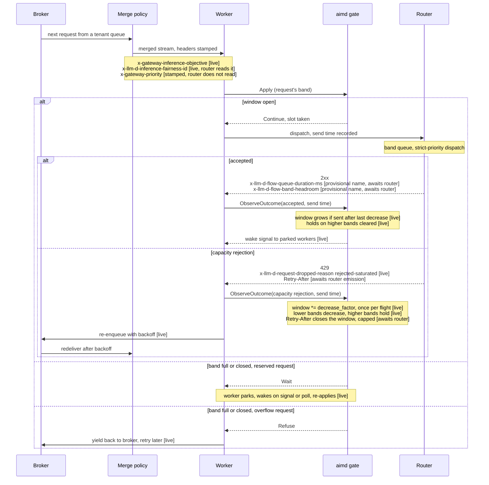
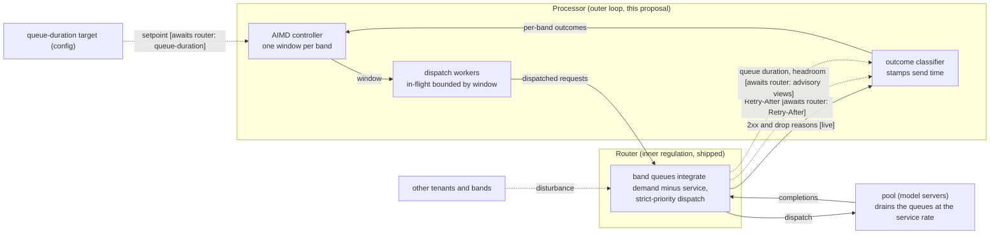
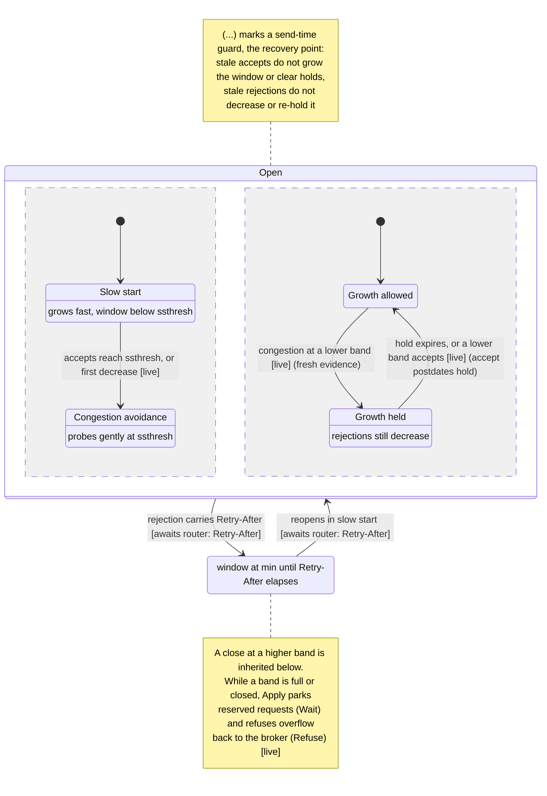

# Feedback-Based Dispatch Control

Status: proposed. The `aimd` gate is submitted as llm-d-async#382; the worker wiring and the e2e benchmark follow in separate PRs. Two contract header names are provisional pending ratification with `llm-d-router`.

Scope: this proposal covers the async-processor side only — what this repository consumes, stamps, and controls. The responsibility boundary between the processor and the router's flow control layer, and the router-side signal work, are being designed jointly with the `llm-d-router` maintainers and will be proposed there separately; this proposal depends on nothing from that work beyond signals the router already ships.

## Summary

The processor's metric dispatch gates estimate inference-pool capacity from outside: Prometheus metrics behind a cache, a capacity formula with constants copied from the router's configuration, and a single reaction (dispatch throttled to near zero) to every HTTP 429. This proposal replaces external estimation with response feedback. Every dispatched request already returns an acceptance, a reason-coded rejection, or an error; a new `aimd` pool gate treats that stream as its capacity signal and sizes one dispatch window per priority band. The gate works against an unmodified `llm-d-router` today and improves incrementally as the router ships each contract field. The follow-up PRs include an e2e benchmark comparing the gate with the metric-gated configurations on the same workload.

## Motivation

Each of the metric gates' estimating mechanisms couples the processor to the router's internals with no contract underneath, and each fails differently:

- **Staleness.** The Prometheus reads sit behind a five-second cache, while pool conditions move on millisecond scales. The gate acts on conditions that have already changed.
- **Drift.** The capacity formula copies constants such as `max_concurrency` from the router's configuration, and the metric names it reads carry no contract. A change on either side silently breaks the estimate.
- **Conflated rejections.** The only rejection signal is the status code, so every HTTP 429 draws the same reaction, dispatch throttled to near zero. The router also rejects for queue-TTL expiry and revokes admitted work by eviction, and those call for different responses.
- **Gateway bypass.** The `endpoint-scrape` gate can read the model servers' metrics directly (e.g. `vllm:num_requests_waiting`), so its view of capacity and the view of the gateway that admits the traffic can disagree.

This proposal inverts the direction of information flow. Every dispatched request returns an acceptance, a rejection with a reason, or an error, so the processor already holds a capacity signal with no cache in front of it and no third-party service in the dispatch path. The coupling that remains is the reason strings and header names themselves; the contract below records each with its status. An unrecognized reason falls back to the bare-429 classification, so the gate loses resolution there but keeps a correct signal.

### Goals

- Replace scraped-metric capacity estimation with per-response feedback for pools fronted by a gateway that returns reason-coded rejections.
- React to rejections by reason (capacity, queue-TTL expiry, eviction, other) instead of treating every 429 as saturation.
- Control dispatch per priority band (a classification–tier pair, defined under Proposal), coupled the way the gateway's strict-priority dispatch couples the bands.
- Keep every contract field independently useful: the gate must work with none of them, and each router-side addition must improve it without a coordinated release.
- Make the controller observable (per-band window state as gauges).

### Non-Goals

- Booking capacity or replicating router arbitration state in the processor; the gate consumes signals and never holds reservations.
- Any change to durability, retry ownership, or queue semantics; requests keep waiting durably in the broker (the message queue the processor pulls requests from), and retries remain the processor's.
- Router-side implementation (Retry-After emission, advisory views); those are recorded as follow-up work, not delivered here.
- Ratifying the advisory header names; that is a joint decision with `llm-d-router` and the names here are marked provisional.
- Removing the metric gates; they remain the supported path for backends with no gateway.

## Proposal

The processor gains one mechanism in each direction of the boundary:

1. **Consume the router's response signals.** The HTTP client captures the drop-reason header ([`x-llm-d-request-dropped-reason`](https://github.com/llm-d/llm-d-router/blob/eb1e027a7db8bff1086c20bc3080119a3d88f274/pkg/common/error/error.go#L30-L44), shipped in the router today along with the reason strings the table below classifies) and `Retry-After`. The worker classifies each response and reports it to the pool gate, together with any advisory view headers present. A new `aimd` gate type sizes one dispatch window per band from that feedback. A band is a classification–tier pair: `reserved` (within a tenant's guaranteed quota, not to be shed) or `overflow` (beyond quota, sheddable), crossed with `interactive`, `async`, or `batch`. This is the same six-way partition the `tier-priority` merge policy uses. Unknown tiers and classifications default to `batch` and `overflow`.

   | Response | Outcome | Window effect |
   |---|---|---|
   | 2xx | accepted | grows (slow start or additive increase) |
   | reason `rejected-saturated`, or bare 429 | capacity rejection | multiplicative decrease; `Retry-After` closes the window for its duration, capped by configuration |
   | reason `rejected-ttl-expired` | queue-TTL expiry | gentle decrease (×0.9) |
   | reason `evicted*` | eviction | none |
   | any other reason | non-capacity rejection | none |
   | transport or bare 5xx error | error | none |

   Below a threshold (`ssthresh`), a band's window grows by `increase` per accept, roughly doubling per window's worth of accepts (slow start); at or above it, by `increase/window` per accept (additive increase). A capacity rejection multiplies the window by `decrease_factor` (default 0.5) and sets `ssthresh` there. Both factors are conventions: 0.5 is TCP's halving, and the 0.9 applied on queue-TTL expiry backs the band off without costing a full multiplicative step. A `Retry-After` on the rejection closes the band for its duration, capped by configuration: the header is advisory ([RFC 9110](https://www.rfc-editor.org/rfc/rfc9110#field.retry-after)), the projection behind it rides on a drain-rate estimate, and a closed band produces no responses that could correct a wrong one.

   Two advisory headers refine the controller when present: advertised band headroom caps the window at in-flight plus headroom, and with a target configured, an accepted response that queued past the target holds the window instead of growing it, since queue time rises before rejections start. The queue-duration signal also sets the controller's operating point. A rejection-driven controller settles wherever the detector begins rejecting: near the concurrency limit under a detector that rejects early, on top of a standing queue under one that admits into deep queueing before rejecting. With a delay target the gate regulates ahead of the rejection threshold instead of inheriting it, so the benchmark plan covers detector configurations of both kinds.

   The window bounds in-flight requests per band. When a band's window is full or closed, only reserved requests park a dispatch worker until a slot frees; overflow requests are refused back to the broker and retry from there. A parked worker is unavailable to every band, so parking is limited to the traffic that cannot be shed.

2. **Feed the router's fairness arbitration.** The merge policies (the components that interleave tenant queues into a single dispatch stream) stamp the tenant attribute the quota gate (the per-tenant dispatch-limit gate) already keys on (default `userid`) into the router's fairness header ([`x-llm-d-inference-fairness-id`](https://github.com/llm-d/llm-d-router/blob/eb1e027a7db8bff1086c20bc3080119a3d88f274/pkg/epp/metadata/consts.go#L34)). The router's arbitration can then isolate tenants after dispatch using an attribute both sides already carry.

The contract, with the status of each field:

| Field | Direction | Status |
|---|---|---|
| `x-llm-d-request-dropped-reason` | router → processor | shipped in the router; consumed |
| Bare 429 as capacity rejection | router → processor | fallback for gateways without reasons |
| `Retry-After` on capacity rejections | router → processor | consumed if present, as a bounded hint; router does not emit yet |
| `x-llm-d-inference-fairness-id` | processor → router | read by the router; stamped by the reference implementation |
| `x-llm-d-flow-queue-duration-ms` | router → processor | provisional name; consumed if present |
| `x-llm-d-flow-band-headroom` | router → processor | provisional name; consumed if present |
| Deadline header → TTL hint | processor → router | not yet defined on either side |

The diagram below answers which of these fields carry signal on a round-trip today: it traces one dispatch through the accept and capacity-rejection paths, with each header labeled by its status from the table. Two label families recur in every figure in this document: `[live]` marks behavior that fires against today's router, and `[awaits router: <signal>]` marks code that is dormant until the router emits the named signal.



The reference implementation (the gate in llm-d-async#382; worker wiring and the benchmark following) comprises:

- drop-reason capture on `api.ClientError`;
- the feedback contract in `pipeline`: outcome classification, advisory views, and wait notification (waking parked workers when a window opens);
- the `aimd` gate: per-band windows, slow start, flight-coalesced decrease, ladder coupling, and send-time ordering guards (the latter three defined under Design Details);
- fairness-id stamping in both merge policies;
- per-band gauges: `async_aimd_window`, `async_aimd_ssthresh`, `async_aimd_inflight`;
- unit, worker-scenario, and e2e benchmark coverage.

All changes are additive: existing queue configurations and the metric gates keep working, and adoption is a per-pool `gate_type` change.

## Design Details

### Stock, flow, and the integral between them

The router's saturation gauge is a stock signal: how full is the pool now. The processor's decision is a flow question: how fast will room appear. The object connecting them is the queue, because queue depth is the accumulated difference between demand and supply:

```
  rate                                   queue depth  Q(t) = the shaded area
   |        demand λ(t)                    |
   |       .--------.                      |         /\
   |_______|########|________              |        /  \   drains at slope ≈ −μ̂
   |       |########|                      |       /    \
   |------------------------ supply μ(t)   |______/______\______ watermark W
   |  # = ∫(λ−μ) dt = queue depth          |     /:      :\
   '------------------------- time         '----/-:------:--- time
                                             rejected    RA
```

Q(t) = ∫(λ − μ) dt. The three pending signals are readings of this picture:

- **Queue duration** (piggybacked on a response) is the realized horizontal width of the area for a request that completed.
- **Retry-After** is the projected horizontal distance from now until Q, descending at the current drain rate μ̂, crosses the watermark W of whichever constraint rejected the request.
- **Band headroom** is the current vertical gap between Q and the band's capacity.

One estimator, {Q per band, μ̂}, produces all three fields. Q per band already exists in the router's [registry statistics](https://github.com/llm-d/llm-d-router/blob/eb1e027a7db8bff1086c20bc3080119a3d88f274/pkg/epp/flowcontrol/contracts/registry.go#L161-L173); μ̂ (a drain-rate estimate, e.g. an exponentially weighted average of dispatch completions per second) is the single flow signal the router does not compute today.

The block diagram below places each contract signal on the loop around this integrator. The processor closes an outer loop around the router's inner regulation, which is shipped behavior; solid feedback arrows carry signal today, and dashed arrows tagged `[awaits router: …]` are dormant until the router emits them. The controller has no error term in the classical sense: it probes until a constraint signal fires. A configured queue-duration target is the exception, giving the loop a setpoint.



### The priority ladder

Suppose 64 workers dispatch against a pool whose gateway admits 32 concurrent requests. Batch traffic starts drawing `rejected-saturated` while interactive traffic is still accepted. The batch window should shrink. The open questions are what the interactive band should learn from batch's rejections, and what batch should learn from interactive's accepts.

The router [dispatches bands in strict priority order](https://github.com/llm-d/llm-d-router/blob/eb1e027a7db8bff1086c20bc3080119a3d88f274/pkg/epp/flowcontrol/controller/internal/processor.go#L359), and its usage-limit policies are [monotone by conformance contract](https://github.com/llm-d/llm-d-router/blob/eb1e027a7db8bff1086c20bc3080119a3d88f274/pkg/epp/framework/interface/flowcontrol/plugins.go#L151-L154), so rising saturation gates the lowest band first and climbs. Even with every band's dispatch ceiling (the saturation level above which the router stops dispatching that band) set to 1.0, priority-descending dispatch starves the lowest bands first under contention, and their queued requests TTL-expire first. Congestion therefore has a level on the priority ladder at any moment.

Each band's outcomes observe that level from one side only: an accept at band b proves the level is below b, a rejection or queue-TTL expiry at b proves it is at or above b, and neither reads the level itself. (In statistical terms, each band's outcome stream is a censored sensor of the level.) The gate's cross-band rules are the update rules of an estimator of the level:

- rejection at b → decrease b and every band below (they are at least as gated); hold growth in every band above (their margin is shrinking).
- TTL expiry at b → gentle decrease at b; the same hold above.
- accept at b → grow b; clear holds above b (this accept is proof of margin below them).

Sheddable traffic (traffic admitted on the condition that it can be rejected) runs at the pool's edge, where a rejection is cheap: the request survives in the broker and retries. Its rejections supply most of the evidence the gate uses to grow the higher bands.

The coupling rules assume the router dispatches these bands in the order the processor ranks them. The router assigns a request's band from the inference objective it resolves to, not from a stamped priority, so the assumption holds where each tier maps to an objective whose priority agrees with the processor's lane order; aligning that mapping is part of the taxonomy ratification under joint work. Where the router distinguishes fewer bands than the processor models, rejections arrive without regard to processor rank and the coupling degrades toward one shared window across the merged bands: more throttling than per-band control, in the conservative direction.

### Evidence ordering

Outcomes arrive out of order with respect to sends. A rejection returns in one round trip; an accept returns after queueing plus generation, so an accept observed after a rejection may describe conditions from before it. The rule, borrowed from TCP's recovery point: optimistic updates (growth, hold-clearing) require the accepted request to have been sent after the evidence they override. The guard is conservative in the correct direction, because an accept proves margin at dispatch time, which is bounded below by send time.

The diagram below shows the modes of one band's controller. The two regions inside Open vary independently: one tracks how fast accepts grow the window, the other whether growth is allowed at all. Transitions mark mode changes only — the per-outcome window arithmetic is in the outcome table under Proposal, and evictions, non-capacity rejections, and errors change no mode and no window (`[no-op by design]`). Every mode change fires against today's router except the close and reopen, which wait on Retry-After.



### Sampling and statistical significance

Events carry different evidence weight at different concurrencies. The additive and multiplicative sides of the controller handle this differently.

The additive side is already normalized: `increase/window` per accept yields constant growth per window-epoch whether the window is 2 or 200. This is TCP's per-round-trip normalization.

The first problem on the multiplicative side is burst multiplicity: N rejections from one congestion event must count as one decrease. A wall-clock cooldown coalesces in the wrong dimension, since one second spans many flights when generations are short and a fraction of one flight when decodes are long. The dimensionless coalescing unit is the flight: a rejection whose request was sent before the band's previous decrease belongs to the event already acted on. The recovery point that gates optimistic updates already supplies this boundary.

The second is per-event weight: even one decrease per flight discards half of a 200-slot window on a single marginal rejection, which may be a race for the last band slot rather than real congestion. DCTCP's answer fits: decrease proportional to an exponentially weighted fraction of rejected outcomes per flight (`w ← w(1 − α/2)`). It degrades correctly at both extremes: at window 1 a rejection is the entire sample and the decrease approaches halving, while at window 200 one rejection is negligible. It needs per-flight outcome accounting, so it is deferred to work-plan item 6, to be adopted only on benchmark evidence of over-reaction.

The advisory views sit outside this asymmetry: band headroom is written at response time and is fresh regardless of send time; queue duration describes the interval from send to dispatch; outcomes evidence dispatch-time conditions and are the stalest. The recovery-point guard therefore applies only to outcome-derived updates; the headroom cap is exempt.

### Work plan (this repository)

1. Eviction-rate damping: sustained evictions in a band should weaken the upward "there is margin" inference from that band's accepts, since overcommitted accepts overstate capacity.
2. Tighten the recovery-point guard using queue duration when present (dispatch time = send time + queue duration, a later and sharper bound than send time).
3. Flight-time-scaled hold duration: derive the growth-hold cooldown from a per-band estimate of send-to-outcome latency, the way TCP derives its retransmission timeout from measured round-trip time. A wall-clock constant expires mid-event under long decodes and outlives the event under short ones.
4. Per-band outcome counters (`async_aimd_outcomes_total` by band and outcome), so a window pinned at the floor is attributable: dominant capacity rejections mean saturation; dominant queue-TTL expiries mean deadline budgets the pool cannot meet at any window size.
5. Scrape the processor's metrics endpoint in the e2e Prometheus to capture per-band window trajectories during benchmarks.
6. DCTCP-style proportional decrease (`w ← w(1 − α/2)`, α an EWMA of the rejected fraction per flight), weighting congestion evidence by sample size at high concurrency. Adopt only if future benchmarks show over-reaction.

Router-side signal work (Retry-After emission and its drain-rate estimate, the queue-duration and band-headroom piggybacks, the deadline-to-TTL mapping) and joint ratification (the advisory header names, the priority taxonomy that names the tiers and classifications, and a conformance test) are being worked with the `llm-d-router` maintainers and will be proposed there separately. Within that work, the queue-duration piggyback carries the same weight as Retry-After emission, for the operating-point reason under Proposal, and the conformance test should assert that the objective-to-priority mapping preserves the processor's lane order.

## Alternatives

**Keep the metric gates and improve them.** Polling faster or caching less does not change the shape of the signal: the gauge is still a stock reading, and the release decision needs the flow side of the picture under "Stock, flow, and the integral between them". The copied constants and metric names remain uncontracted at any polling rate. The metric gates stay supported for backends with no gateway; they stop being the primary integration for gateways that offer reason-coded responses.

**Rate-based control (token bucket with AIMD on the rate).** Rejected. A concurrency window self-clocks: an accept frees a slot and grows the window in the same event, so the dispatch rate tracks the pool's service rate without estimating it, and variable generation lengths are priced in by construction (a long decode holds its slot for as long as it holds pool capacity). A rate controller needs an explicit service-rate estimate and mis-handles decode-length variance.

**Continuous latent-saturation estimator.** Rejected for now. The processor observes only the *order* of the bands' ceilings, never their values, so a continuous estimate adds tuning surface without information. The upgrade path is preserved: when the contract carries numeric per-band state, the estimator improves by swapping sensor quality, and the control law does not change. Any future modeling change should preserve that invariance.

**Price-based control (network utility maximization).** Rejected. An explicit price estimator would have the processor reconstructing router arbitration state, which the scope boundary rules out.

**One shared pool window decomposed by priority.** Rejected. It matches the pool's physics but erases the ceiling structure: batch can be legitimately rejected while interactive has real room, and a shared window over-throttles the top on rejections at the bottom.

**Hold-clearing by source tracking.** Rejected. The natural bookkeeping records which band's evidence set each growth hold and requires an accept at that band to clear it. It fails in the normal operating regime: under stable partial saturation (sheddable squeezed out, a middle band flowing, which is the intended steady state once sheddable admission is overcommitted), source tracking leaves the top bands held indefinitely by the rejection stream below, while the flowing band in between is continuing evidence of their margin. The proposed rule (an accept at any lower band clears the holds above it) is simpler and handles this regime.

**Reacting to evictions.** Rejected. An eviction is admitted work revoked to make room for higher-priority work; the request retries from the broker, and the sender loses only the compute already spent. A single eviction carries no saturation information. A sustained eviction rate should eventually damp the margin inference (work-plan item 1).
