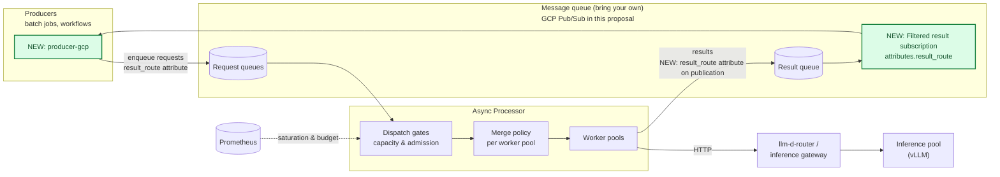

# GCP Pub/Sub Producer Library

Status: accepted on [issue #438](https://github.com/llm-d/llm-d-async/issues/438).
This document records the design locked there so the implementation can be reviewed against it.

## Summary

Add a top-level `producer-gcp/` Go module that implements `api.Producer` against GCP Pub/Sub.
Redis callers keep using `producer/`.
A GCP-only caller never imports `go-redis`.
The processor stamps a dedicated `result_route` attribute on result publications so each producer can attach a filtered result subscription and see only its own results.

## Motivation

The producer library today lives next to the Redis client.
`Producer` is defined in that same module, so any implementation that satisfies it pulls `go-redis` into the caller's build.
The processor already speaks Pub/Sub: it unmarshals a plain `RequestMessage` from message data, copies attributes into metadata, and publishes every result to a single `result_topic_id` with empty attributes.
That last part is the parity gap.
Redis routes results per request via `result_queue_name`.
On Pub/Sub, every producer on a result topic would otherwise see every result.

### Goals

- Ship a Pub/Sub producer that can submit requests and receive only its own results.
- Keep Redis and GCP client libraries in separate modules.
- Idempotently provision the topics and subscriptions the README already requires for the processor, including a DLQ.
- Leave a publish-only identity a way to skip admin calls.

### Non-Goals

- Durable result delivery (`ReceiveResult` / `RenewResult` / `AckResult`).
  Left out of v1; Pub/Sub ack maps onto that later if a caller appears.
- End-to-end cancel.
  The Pub/Sub consume path has no cancellation check, so `CancelRequests` returns `api.ErrNotSupported`.
- Granting DLQ IAM.
  The producer creates the DLQ topic and subscription; operators grant the Pub/Sub service agent.
- Echoing all request metadata onto result publications.
  Only `result_route` is stamped.

## Proposal

1. Move `Producer` (and `ErrNotSupported`) into `api`.
   Keep `DurableResultProducer` and `ResultDelivery` in `producer`.
   Their ownership fields cannot be populated cross-package.
   `producer` keeps `type Producer = api.Producer` so existing Redis callers compile.
2. Add `github.com/llm-d/llm-d-async/producer-gcp` as a top-level module so `make set-version` and the submodule-tag workflow pick it up without Makefile changes.
3. The producer publishes a plain `RequestMessage` as message data and sets `result_route` as the only message attribute.
   Caller metadata stays in the body, which is what `pkg/pubsub` already decodes.
   There is no Redis-style `InternalRequest` envelope.
4. `resultWorker` stamps that same `result_route` value as the only result attribute.
   Each producer creates a result subscription filtered on `attributes.result_route = "<route>"`.
5. `NewProducer` (default) idempotently creates the request topic, DLQ topic and subscription, request subscription, result topic, and this producer's result subscription.
   `AlreadyExists` is success after verifying the existing subscription's topic (and, for the result subscription, its filter).
   `WithoutCreateResources` skips provisioning.

## Design Details

The diagram keeps the README's architecture terminology and highlights the new producer library and filtered result subscription in green.
The result publication also gains the `result_route` attribute.

For GCP Pub/Sub, **Request queues** means the request topic and processor subscription.
**Result queue** means the result topic, with the producer consuming through its filtered subscription.
The processor's existing `resultWorker` stamps the result attribute; this is not a new processing stage.

### Module layout

| Module | Import | Client libraries |
| --- | --- | --- |
| `api` | `github.com/llm-d/llm-d-async/api` | none |
| `producer` | `github.com/llm-d/llm-d-async/producer` | `go-redis` |
| `producer-gcp` | `github.com/llm-d/llm-d-async/producer-gcp` | `cloud.google.com/go/pubsub/v2` |

### Config

Required: `ProjectID`, `RequestTopicID`, `RequestSubscriptionID`, `ResultTopicID`, `ResultRoute`.
`RequestSubscriptionID` must match the processor's `subscriber_id`.
`ResultRoute` is the filter value and, by default, the result subscription ID.
Optional: `ResultSubscriptionID`, `DeadLetterTopicID` (default `<RequestTopicID>-dlq`), `DeadLetterSubscriptionID` (default `<DeadLetterTopicID>-sub`).

Two producers that share `ResultRoute` and `ResultSubscriptionID` compete on one subscription (Redis-like).
Two producers that share `ResultRoute` but use different subscription IDs each receive a copy.

### Provisioning

On create, the request subscription is configured as the README describes:

- exactly-once delivery
- exponential backoff retry (10s–600s)
- dead-letter topic with `max_delivery_attempts=5`
- ack deadline of 600s, covering one in-flight inference attempt
- expiration policy with no TTL, so the processor subscription never expires

The emulator and `pstest` accept exactly-once but do not honor it.
Tests assert the field is set, not the delivery effect.

The result subscription does not expire, same as the request subscription.
An idle producer would otherwise lose the subscription, and every result published after that would be dropped.
The DLQ subscription never expires, so poison messages are not dropped by idle TTL.

`NewProducer` takes a context.
A deadline on that context is used as-is, so the caller can cancel provisioning or wait on a slow endpoint.
With no deadline, provisioning stops after 30s.

`AlreadyExists` handling:

- Topic: treat as success.
- Subscription: `GetSubscription` and fail if `topic` does not match.
- Result subscription: also fail if `filter` does not match.
- Other settings (exactly-once, retry, DLQ, ack deadline, expiration) are not mutated on an existing subscription.
  Operators who created the processor subscription by hand keep their values.
  A subscription created with an inactivity TTL keeps that TTL.
  Delete it once so the next `NewProducer` creates it with no expiry.

### DLQ IAM

Creating a dead-letter policy is not enough in a real project.
The Pub/Sub service agent `service-{project-number}@gcp-sa-pubsub.iam.gserviceaccount.com` must be able to:

- `pubsub.subscriber` (or `pubsub.subscriptions.consume`) on the request subscription
- `pubsub.publisher` on the DLQ topic

`gcloud pubsub subscriptions create --dead-letter-topic=...` grants these.
The producer does not call the IAM API.
A publish-only identity should use `WithoutCreateResources` and leave provisioning to Terraform or `gcloud`.

### Result routing

`api.ResultRouteAttribute` is `"result_route"`.
The producer sets that attribute to the configured route.
Caller metadata is not copied onto attributes, because attribute maps have hard size limits the JSON body does not.
The processor copies request attributes into `RequestMessage.Metadata`, which overwrites a caller-supplied `result_route`, and `NewHTTPResult` / `NewErrorResult` copy that metadata onto `ResultMessage.Metadata`.
A gate that builds its own drop result has to copy request metadata itself.
The tier-priority admission gate does this for its 429 result.
The Pub/Sub worker forwards that metadata and does not fill in a missing route.
`resultWorker` reads only `Metadata["result_route"]` and publishes it as a Pub/Sub attribute.
Requests with no route keep today's empty attributes, so existing e2e publishers and unfiltered result subscriptions keep working.

### CancelRequests

Returns `nil` for an empty ID list (a no-op) and `api.ErrNotSupported` otherwise.
There is no cancel topic and no worker-side cancel check on the Pub/Sub path.

### Close and concurrency

The first `GetResult` starts one `Receive` and feeds a buffered channel.
Later calls drain that channel.
A result stays unacknowledged until `GetResult` hands it to the caller, so a crash redelivers anything still buffered.
A caller whose context is already cancelled returns without taking a result.
If `Receive` returns an error, that call returns the error and the next `GetResult` starts a new stream.
`SubmitRequest` may be called concurrently.
`Close` stops the result receive, nacks anything still buffered, and stops the request publisher.
When the producer owns the client, `Close` closes it too.
It leaves those fields set.
A later call fails on the stopped publisher or the closed producer.

## Alternatives

- Nested `producer/gcp/` module.
  Cleaner path, but `make set-version` and the tag workflow only look one level deep for `go.mod`.
  Top-level `producer-gcp/` matches the existing tooling.
- Move `DurableResultProducer` into `api`.
  Rejected: `ResultDelivery`'s claim fields are private and only a same-package implementation can populate them.
- Echo every request attribute onto the result.
  Rejected: a result subscription filter on one dedicated key is enough, and it avoids leaking caller metadata onto the result topic.
- Invent a cancel topic for v1.
  Rejected: the consume path would ignore it, so a producer-side cancel would be a no-op end to end.
- Include durable results in v1.
  Rejected: no in-tree caller yet; Pub/Sub ack/lease maps cleanly onto that interface later.
